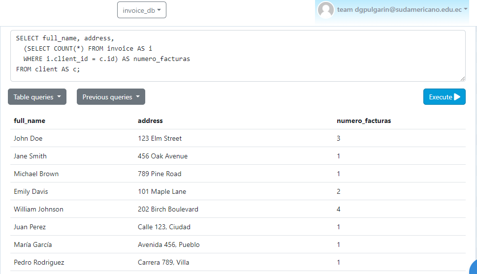
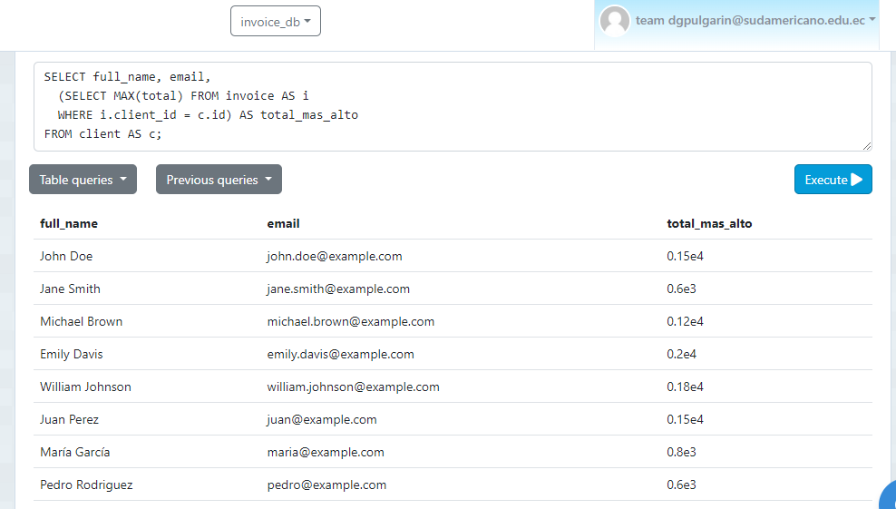
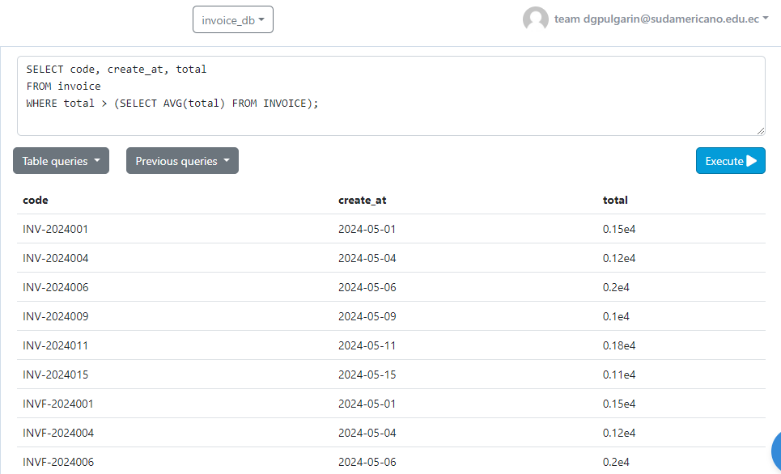
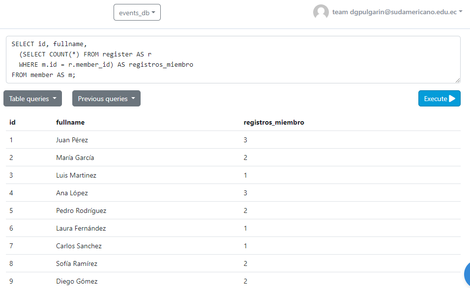
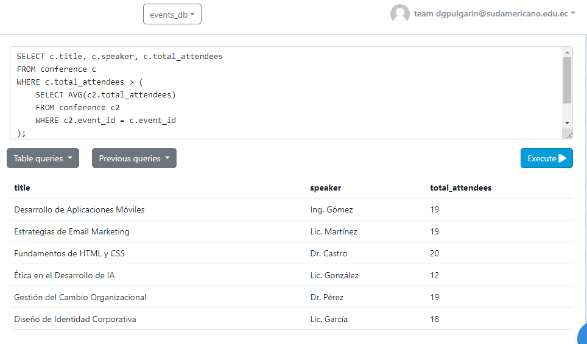

# Sentencias SQL y Capturas

## 1. El numero total de facturas realizadas por cada cliente.:
### Sentencia
`SELECT full_name, address,`
  `(SELECT COUNT(*) FROM invoice AS i`
  `WHERE i.client_id = c.id) AS numero_facturas`
`FROM client AS c;`

## 2. Listar nombre y correo de los clientes junto a su compra mas cara realizada:
### Sentencia
`SELECT full_name, email,`
  `(SELECT MAX(total) FROM invoice AS i`
  `WHERE i.client_id = c.id) AS total_mas_alto`
`FROM client AS c;`

## 3. Listar las facturas donde sus totales sean mayores al promedio de las factura:
### Sentencia
`SELECT code, create_at, total`
`FROM invoice`
`WHERE total > (SELECT AVG(total) FROM INVOICE);`

## 4. Listar el numero de registros realizados por cada miembro:
### Sentencia
`SELECT id, fullname,`
  `(SELECT COUNT(*) FROM register AS r`
  `WHERE m.id = r.member_id) AS registros_miembro`
`FROM member AS m;`

## 5. Listar el titulo y orador unicamente de las conferencias que tengan un numero de asistentes que esté por encima del promedio de su respectivo evento:
### Sentencia
`SELECT c.title, c.speaker, c.total_attendees`
`FROM conference c`
`WHERE c.total_attendees > (`
    `SELECT AVG(c2.total_attendees)`
    `FROM conference c2`
   `WHERE c2.event_id = c.event_id`
`);`

